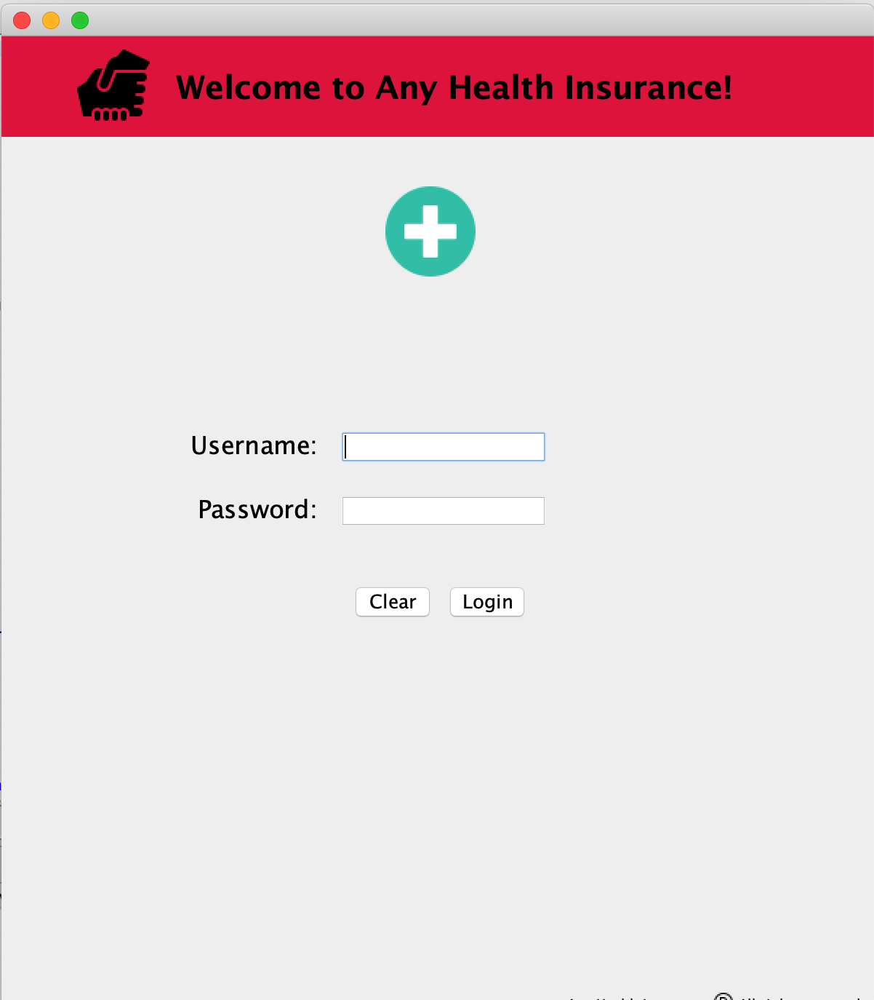
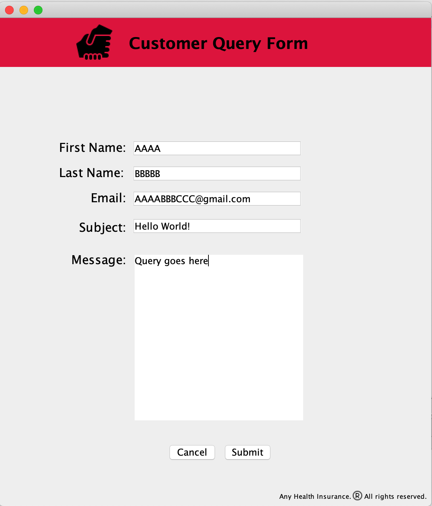

<h1>Description</h1>

Built an customer query application using JFrame and Swing in java which :
<ol>
   <li>Allows user to login into his account by inputting correct username and password (which can be found below in instructions).</li>
   <li>Allows user to fill query form and enter his/her e-mail address to get an reply e-mail from the email account the user wants about the query.</li>
</ol>
   PS: To get the reply email, user needs to provide the
   login credentials of the sender email account in the program
 

<h1>Instructions</h1>

<ol>
<li>Username is "orange" and Password is "apple" which can be changed using lines 124 and 125 in LoginPage.java file.</li>

<li>Sender e-mail needs to be input by the user of this Application using line 195.
   Also sender e-mail address and password needs to be input by the user using lines 169 and 170 in QueryForm.java file.</li>

<li>Only gmail domain needs to be used when entering the e-mail for both sender and reciever. If any other domain is used a pop-up dialog error message box        will appear on the screen indicating for the usage of email address with gmail domain.</li> 
</ol>

 
<h2>Application Demo</h2>

